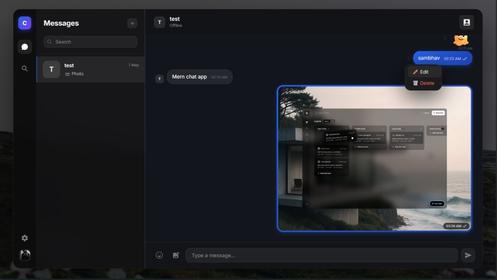
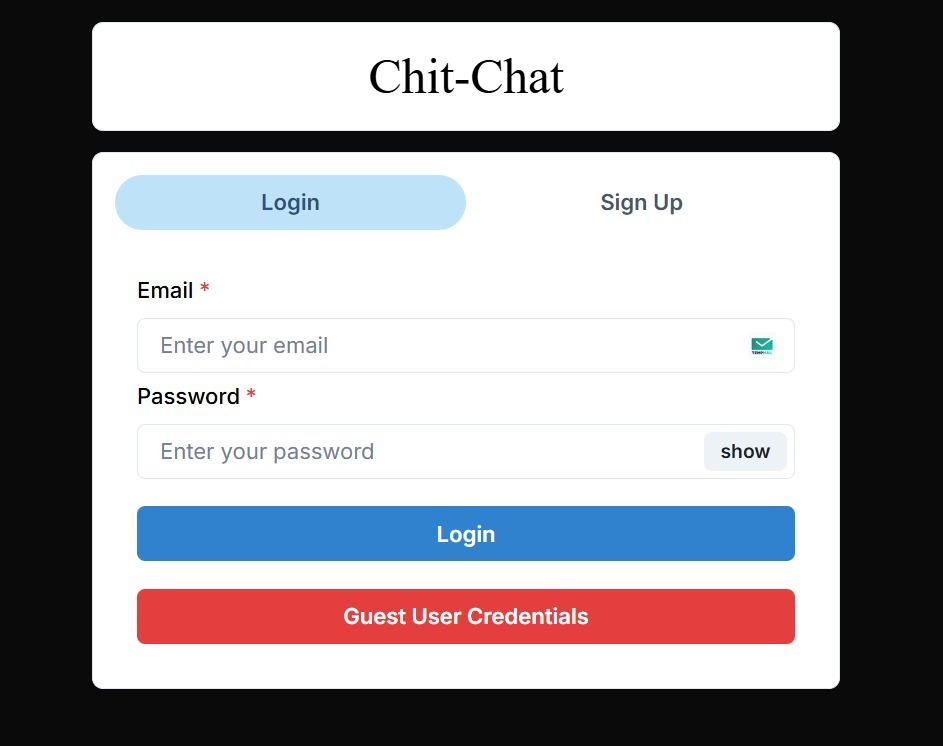
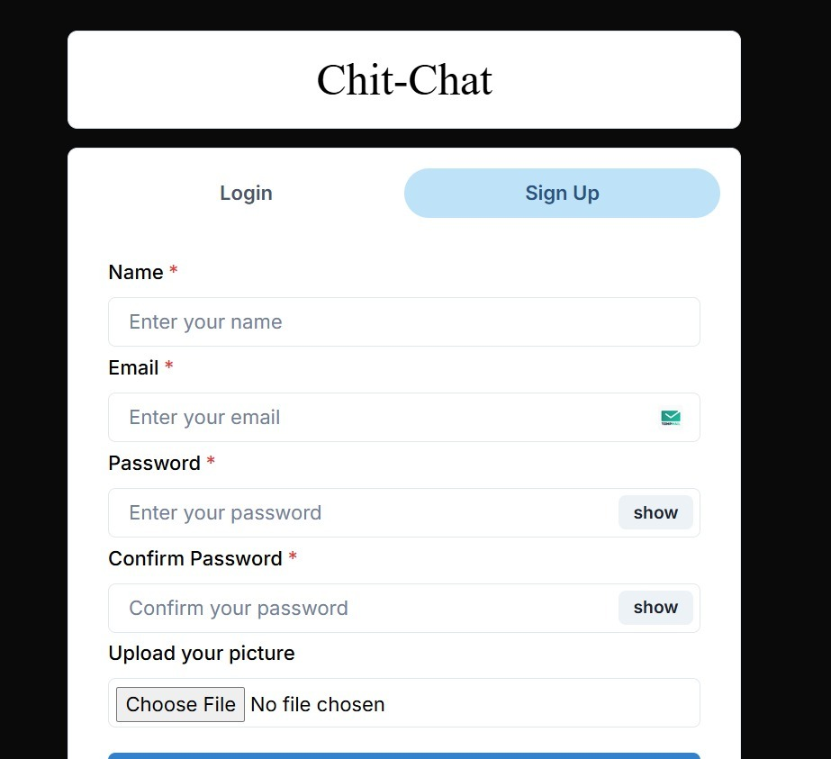

# 🌌 Dusk

Dusk is a premium, full-stack real-time chatting application built with the MERN stack. Featuring a sleek **glassmorphism** design, it provides a seamless and visually stunning experience for instant communication.



## ✨ Features

- 🔐 **Secure Authentication**: JWT-based login and signup with bcrypt password encryption.
- 💬 **Real-time Messaging**: Instant message delivery using Socket.io.
- 👥 **Group Chats**: Create and manage groups, add/remove members, and update group details.
- 🔍 **User Search**: Easily find and connect with other users.
- 🖼️ **Image Support**: Share images and customize your profile.
- 🔔 **Real-time Notifications**: Stay updated with message badges and alerts.
- ✨ **Glassmorphism UI**: Beautifully designed interface using Chakra UI and Framer Motion.
- ⌨️ **Typing Indicators**: See when someone is typing in real-time.

## 🛠️ Tech Stack

**Frontend:**
- [React.js](https://reactjs.org/) - UI Framework
- [Chakra UI](https://chakra-ui.com/) - Component Library
- [Framer Motion](https://www.framer.com/motion/) - Animations
- [Socket.io-client](https://socket.io/) - Real-time communication

**Backend:**
- [Node.js](https://nodejs.org/) - Runtime Environment
- [Express.js](https://expressjs.com/) - Web Framework
- [MongoDB](https://www.mongodb.com/) - Database
- [Socket.io](https://socket.io/) - Real-time server logic

## 🚀 Getting Started

### Prerequisites
- Node.js installed
- MongoDB Atlas account or local MongoDB instance

### Installation

1. **Clone the repository:**
   ```bash
   git clone https://github.com/ojaswishivam/Dusk.git
   cd Dusk
   ```

2. **Install Backend Dependencies:**
   ```bash
   npm install
   ```

3. **Install Frontend Dependencies:**
   ```bash
   cd frontend
   npm install
   ```

4. **Environment Setup:**
   Create a `.env` file in the root directory and add the following:
   ```env
   PORT=5000
   MONGO_URI=your_mongodb_connection_string
   JWT_SECRET=your_jwt_secret
   NODE_ENV=development
   ```

5. **Run the Application:**
   From the root directory:
   ```bash
   # Build frontend and start server
   npm run build
   npm start
   ```

## 📸 Screenshots

### Authentication
<div align="center">
  
  
</div>

### Chat Interface


## 📄 License
This project is licensed under the ISC License.

---
Built by [Ojaswi Shivam](https://github.com/ojaswishivam)
